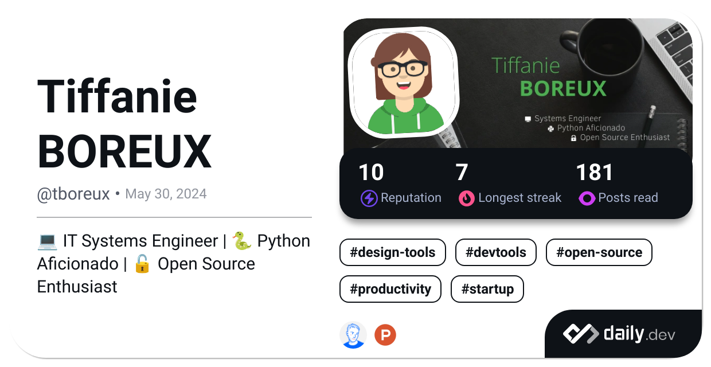

<div align="center">
  
</div>

###

👋 Welcome to my page!

💬 I'm **Tiffanie**, an *IT Systems Engineer* from 🇧🇪 Liège, BELGIUM. I'm an all time student, currently learning [Docker](https://docker.com) and [Python](https://python.org).  
🌱 When I'm not on my computer, you can find me walking in nature with my smartphone to take pictures.

⚡ **Fun fact**: I use spaces over tabs.

## 📕 Latest Blog Posts

<!-- BLOG-POST-LIST:START -->
 - (30/05/2024) “[Local Reverse Proxy](https://tboreux.hashnode.dev/local-reverse-proxy)” <!-- BLOG-POST-LIST:END -->

## 🔗 Connect With Me

<div align="center">

<h3>Follow Me</h3>

[](https://github.com/tboreux/) [](https://gitlab.com/tboreux) [
](https://app.daily.dev/tboreux) [](https://dev.to/tboreux) [
](https://hashnode.com/@tboreux)

[](https://linkedin.com/in/tiffanie-boreux/) [](https://twitter.com/tiffanie_boreux/) [](https://facebook.com/tiffanie.boreux/) [](https://instagram.com/tboreux.photos/) 

</div>

<div align="center">

<h3>Challenge Me</h3>

 [
](https://www.codewars.com/users/tt-bb) [](https://www.codingame.com/profile/fabff2b8890174d9c67a682aec60d98d9366345) [
](https://exercism.org/profiles/ttbb) [
](https://www.freecodecamp.org/ttbb) [
](https://www.hackerrank.com/profile/tboreux) [
](https://leetcode.com/u/tboreux/)

</div>

## 👩‍💻 I Code With...

<details>
<summary><b>🌐 Languages/Frameworks/Databases</b></summary>
<br/>

<div align="center">

            

</div>
</details>

###

<details>
<summary><b>🛠️ Tools</b></summary>
<br/>

<div align="center">

         
        

</div>

</details>

## 📊 Statistics

### GitHub

<div align="center">

 <br>

 

</div>

### Wakatime

<!--START_SECTION:productive-box-in-readme-->
```text
I'm a night 🦉

🌞 Morning     0 commits  ░░░░░░░░░░░░░░░░░░░░░   0.0%
🌆 Daytime     0 commits  ░░░░░░░░░░░░░░░░░░░░░   0.0%
🌃 Evening     0 commits  ░░░░░░░░░░░░░░░░░░░░░   0.0%
🌙 Night     100 commits  █████████████████████ 100.0%
```
<!--END_SECTION:productive-box-in-readme-->

<!--START_SECTION:waka-->

```python
From: 15 March 2023 - To: 05 October 2024

Total Time: 417 hrs 2 mins

HTML                       113 hrs         ■■■■■■▨□□□□□□□□□□□□□□□□□□   26.48 %
Markdown                   83 hrs 38 mins  ■■■■■□□□□□□□□□□□□□□□□□□□□   19.59 %
Python                     60 hrs 10 mins  ■■■▨□□□□□□□□□□□□□□□□□□□□□   14.10 %
YAML                       59 hrs 30 mins  ■■■▨□□□□□□□□□□□□□□□□□□□□□   13.94 %
Bash                       28 hrs 45 mins  ■▨□□□□□□□□□□□□□□□□□□□□□□□   06.74 %
C#                         23 hrs 9 mins   ■▨□□□□□□□□□□□□□□□□□□□□□□□   05.43 %
CSS                        22 hrs 7 mins   ■▨□□□□□□□□□□□□□□□□□□□□□□□   05.18 %
Other                      9 hrs 46 mins   ▨□□□□□□□□□□□□□□□□□□□□□□□□   02.29 %
JavaScript                 7 hrs 35 mins   ▨□□□□□□□□□□□□□□□□□□□□□□□□   01.78 %
JSON                       5 hrs 41 mins   ▨□□□□□□□□□□□□□□□□□□□□□□□□   01.33 %
```

<!--END_SECTION:waka-->

## ♾️ daily.dev


